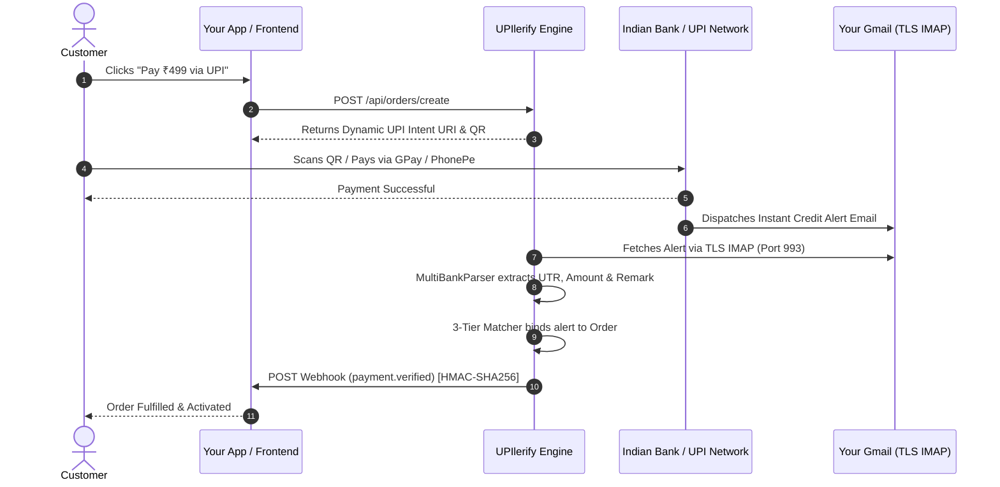

<div align="center">
  
  
  
  <p align="center">
    <strong>The Open-Source, Zero-Fee UPI Payment Verification Engine for Next.js & Node.js</strong>
  </p>

  <p align="center">
    <a href="https://github.com/harshavarma02/upilerify/blob/main/LICENSE"></a>
    <a href="https://github.com/harshavarma02/upilerify/stargazers"></a>
    <a href="https://github.com/harshavarma02/upilerify/network/members"></a>
    <a href="https://nextjs.org"></a>
    <a href="https://www.typescriptlang.org"></a>
    <a href="https://www.upilerify.online"></a>
  </p>

  <p align="center">
    <a href="https://vercel.com/new/clone?repository-url=https://github.com/harshavarma02/upilerify&env=DEFAULT_UPI_ID,DEFAULT_UPI_NAME&envDescription=Enter%20your%20destination%20UPI%20VPA%20and%20Merchant%20Name"></a>
    <a href="https://www.upilerify.online/#sandbox"></a>
    <a href="https://www.upilerify.online/tools"></a>
  </p>
</div>

---

## ⚡ What is UPIlerify?

**UPIlerify** is a self-hostable, developer-first payment engine that eliminates the standard 2% aggregator toll on UPI transactions in India. 

Instead of routing payments through third-party escrow gateways (Razorpay, Cashfree, PayU) that charge fees and enforce lengthy KYC approvals, UPIlerify generates **standard dynamic NPCI UPI Intent QR codes** that settle **100% directly into your personal or merchant bank account**.

When your customer completes the payment, your bank sends an instant credit alert email to your Gmail inbox. UPIlerify's daemon parses this alert in **sub-2.8 seconds** via TLS IMAP, matches the 12-digit UTR, and dispatches a cryptographically signed HMAC-SHA256 webhook to your backend.

---

## ✨ Features

- 🚀 **0% Middleman Toll**: Direct P2P & merchant bank settlement without paying 2% + GST aggregator cuts.
- ⚡ **Sub-2.8s Real-Time Verification**: High-velocity regex matching engine parses bank alert emails via Gmail TLS IMAP in real time.
- 🏦 **13+ Indian Banks Supported**: Built-in pattern recognition for Kotak 811, HDFC Bank, ICICI Bank, SBI, Axis Bank, Paytm Payments Bank, PhonePe, Google Pay, CRED UPI, IndusInd, IDFC FIRST, PNB, and Bank of Baroda.
- 🛡️ **3-Tier Collision Prevention**:
  - **Tier 1 (Exact Remark Match)**: Matches order reference notes (e.g. `ORD-89F2A`).
  - **Tier 2 (Micro-Offset Algorithm)**: Dynamic micro-paisa allocation (e.g. `₹499.01`, `₹499.02`) guarantees collision immunity during concurrent checkouts.
  - **Tier 3 (Manual UTR Fallback)**: Customer can submit their 12-digit UTR with automatic double-spend / replay protection.
- 🔒 **HMAC-SHA256 Signed Webhooks**: Dispatches verified events (`payment.verified`, `order.expired`) with timestamped HMAC signatures.
- 📱 **Mobile-Optimized Checkout Page**: Drop-in customer payment screen (`/pay/[orderId]`) with 1-tap deep links to Google Pay, PhonePe, and Paytm.
- 📊 **Interactive Developer Console**: Built-in test dashboard with real-time Server-Sent Events (SSE) stream, QR generator, and IMAP connection tester.

---

## 🏗️ Architecture & How It Works



---

## 📊 Comparison: UPIlerify vs. Traditional Gateways

| Feature | **UPIlerify (OSS)** | **Razorpay / Cashfree / PayU** |
| :--- | :--- | :--- |
| **Transaction Fees** | **0.00% (Free Forever)** | 2.00% – 3.50% + GST |
| **Settlement Time** | **Instant (Direct into Your Bank)** | T+2 Business Days |
| **KYC / Documentation** | **0 Minutes (Any personal or current UPI ID)** | 3 – 7 Days corporate onboarding |
| **Data Ownership** | **100% Self-Hosted & Private** | Third-party vendor lock-in |
| **Setup Time** | **< 2 Minutes** | Days to weeks |
| **Replay / Fraud Protection** | **3-Tier Collision Avoidance + UTR Dedup** | Proprietary risk engine |

---

## 🛠️ Free Online UPI Utilities

Need to generate a payment QR, deep link, or test UPI parameters without installing the engine? Use our free, 100% in-browser developer & merchant tools at [upilerify.online](https://www.upilerify.online):

| Utility | Description | Access |
| :--- | :--- | :--- |
| 💰 **[UPI QR Code with Amount](https://www.upilerify.online/tools/upi-qr-code-with-amount)** | Generate fixed-amount payment QR codes that lock the invoice total upon scanning. | [**Open Tool →**](https://www.upilerify.online/tools/upi-qr-code-with-amount) |
| 🏦 **[Bank Account to UPI QR](https://www.upilerify.online/tools/bank-account-to-upi-qr-code)** | Convert any Indian account number + IFSC directly into an NPCI QR (zero VPA required). | [**Open Tool →**](https://www.upilerify.online/tools/bank-account-to-upi-qr-code) |
| 💬 **[WhatsApp UPI Payment Link](https://www.upilerify.online/tools/upi-link-generator)** | Create 1-click WhatsApp payment request links and itemized invoice messages. | [**Open Tool →**](https://www.upilerify.online/tools/upi-link-generator) |
| ⚡ **[Dynamic UPI QR Generator](https://www.upilerify.online/tools/upi-qr-generator)** | Customizable payment QR generator with live preview and 1024px SVG/PNG download. | [**Open Tool →**](https://www.upilerify.online/tools/upi-qr-generator) |
| 🔍 **[UPI Handles & Bank Lookup](https://www.upilerify.online/tools/upi-handles)** | Search 150+ PSP handles (@okaxis, @ybl, @oksbi, @ptyes) and find issuing banks. | [**Open Tool →**](https://www.upilerify.online/tools/upi-handles) |
| 🛡️ **[QR Code to UPI ID Extractor](https://www.upilerify.online/tools/qr-code-to-upi-id)** | Upload or scan any QR code to decode parameters and check for phishing risks. | [**Open Tool →**](https://www.upilerify.online/tools/qr-code-to-upi-id) |

> 🔒 **100% Client-Side Privacy**: All tools run entirely in the browser. No banking credentials, amounts, or Virtual Payment Addresses are ever transmitted or stored on any server.

---

## ⚡ 60-Second Quickstart

### 1. Clone & Install
```bash
git clone https://github.com/harshavarma02/upilerify.git
cd upilerify
npm install
```

### 2. Configure Environment Variables
Copy `.env.example` to `.env.local`:
```bash
cp .env.example .env.local
```

Edit `.env.local`:
```env
# Your settlement UPI ID
DEFAULT_UPI_ID=yourname@okaxis
DEFAULT_UPI_NAME="My SaaS Business"

# Gmail IMAP Credentials (for automated verification)
# Generate a 16-character App Password at: https://myaccount.google.com/apppasswords
GMAIL_ADDRESS=yourbusiness@gmail.com
GMAIL_APP_PASSWORD=xxxx-xxxx-xxxx-xxxx

# Target Webhook URL (where payment.verified events will be sent)
WEBHOOK_URL=https://mysite.com/api/webhooks/upi
WEBHOOK_SECRET=whsec_your_custom_secret_key
```

### 3. Run Developer Console
```bash
npm run dev
```
Open [http://localhost:3000](http://localhost:3000) to access the interactive **Merchant Test Console**.

---

## 💻 API Reference

### 1. Create a Payment Order
```bash
curl -X POST http://localhost:3000/api/orders/create \
  -H "Content-Type: application/json" \
  -d '{
    "amount": 499.00,
    "merchantUpiId": "merchant@upi",
    "merchantName": "Acme SaaS",
    "useMicroOffset": true,
    "webhookUrl": "https://mysite.com/api/webhooks/upi",
    "metadata": { "userId": "usr_8819" }
  }'
```

**Response (`200 OK`)**:
```json
{
  "success": true,
  "order": {
    "id": "ord_mte75uuw_sf0z",
    "amount": 499.00,
    "expectedAmount": 499.01,
    "refNote": "ORD-89F2A",
    "merchantUpiId": "merchant@upi",
    "status": "PENDING",
    "createdAt": 1724945800000,
    "expiresAt": 1724946400000
  },
  "upiIntentUri": "upi://pay?pa=merchant%40upi&pn=Acme%20SaaS&am=499.01&cu=INR&tn=ORD-89F2A",
  "checkoutUrl": "/pay/ord_mte75uuw_sf0z"
}
```

---

### 2. Poll Order Status
```bash
curl http://localhost:3000/api/orders/ord_mte75uuw_sf0z/status
```

**Response (`200 OK`)**:
```json
{
  "success": true,
  "status": "VERIFIED",
  "order": {
    "id": "ord_mte75uuw_sf0z",
    "amount": 499.00,
    "expectedAmount": 499.01,
    "status": "VERIFIED",
    "matchedUtr": "499012345678",
    "matchedBank": "HDFC Bank",
    "matchTier": "TIER_1_REMARK",
    "verifiedAt": 1724945815000
  }
}
```

---

### 3. Manual 12-Digit UTR Fallback Verification
```bash
curl -X POST http://localhost:3000/api/verify-utr \
  -H "Content-Type: application/json" \
  -d '{
    "orderId": "ord_mte75uuw_sf0z",
    "utr": "499012345678"
  }'
```

---

### 4. Signed Webhook Payload Format
When a payment is verified, UPIlerify delivers this signed payload to your `WEBHOOK_URL`:

```json
{
  "event": "payment.verified",
  "timestamp": 1724945815000,
  "order": {
    "id": "ord_mte75uuw_sf0z",
    "amount": 499.00,
    "expectedAmount": 499.01,
    "refNote": "ORD-89F2A",
    "merchantUpiId": "merchant@upi",
    "utr": "499012345678",
    "bank": "HDFC Bank",
    "sender": "John Doe",
    "verifiedAt": 1724945815000,
    "status": "VERIFIED",
    "metadata": { "userId": "usr_8819" }
  }
}
```
* **Signature Header**: `X-Upilerify-Signature` contains the `HMAC-SHA256(payload, secret)`.

---

## 🏦 Supported Indian Banks & PSPs

| Bank / PSP | Email Sender / Domain | Remarks Extraction |
| :--- | :--- | :--- |
| **Kotak 811** | `alerts@kotak.com` | ✅ Yes |
| **HDFC Bank** | `alerts@hdfcbank.net` | ✅ Yes |
| **ICICI Bank** | `creditcards@icicibank.com` | ✅ Yes |
| **State Bank of India (SBI)** | `alerts@sbi.co.in` | ✅ Yes |
| **Axis Bank** | `alerts@axisbank.com` | ✅ Yes |
| **Paytm Payments Bank** | `no-reply@paytm.com` | ✅ Yes |
| **PhonePe** | `alerts@phonepe.com` | ✅ Yes |
| **Google Pay** | `googlepay-noreply@google.com` | ✅ Yes |
| **CRED UPI** | `alerts@cred.club` | ✅ Yes |
| **IndusInd Bank** | `alerts@indusind.com` | ✅ Yes |
| **IDFC FIRST Bank** | `alerts@idfcfirstbank.com` | ✅ Yes |
| **Punjab National Bank (PNB)** | `alerts@pnb.co.in` | ✅ Yes |
| **Bank of Baroda** | `alerts@bankofbaroda.com` | ✅ Yes |

---

## 📈 Star History

[](https://star-history.com/#harshavarma02/upilerify&Date)

---

## 💼 Commercial Consulting & Custom Integration

UPIlerify is **100% free and open-source software** under the [MIT License](LICENSE).

Need help integrating UPIlerify into your custom tech stack, e-commerce store, mobile app, or high-throughput webhook pipelines?
- 🛠️ **Done-For-You Deployment & Vercel / VPS Setup**
- 🛍️ **Shopify, WooCommerce & Custom Next.js Integration**
- 🏦 **Bespoke Bank / Wallet Parser Development & Multi-Mailbox Failover**
- 🔒 **High-Availability Self-Hosted Architecture Consulting**

👉 **[Book a Setup & Integration Call](https://www.upilerify.online/#contact)** or email [`harshavarmabackup@gmail.com`](mailto:harshavarmabackup@gmail.com).

---

## 🤝 Contributing

Contributions are welcome! Please review our [Contributing Guide](CONTRIBUTING.md) and [Code of Conduct](CODE_OF_CONDUCT.md) before opening a Pull Request.

---

## 📄 License

UPIlerify is open-source software licensed under the [MIT License](LICENSE).
Released with ❤️ for Indian developers, indie hackers, and founders.
